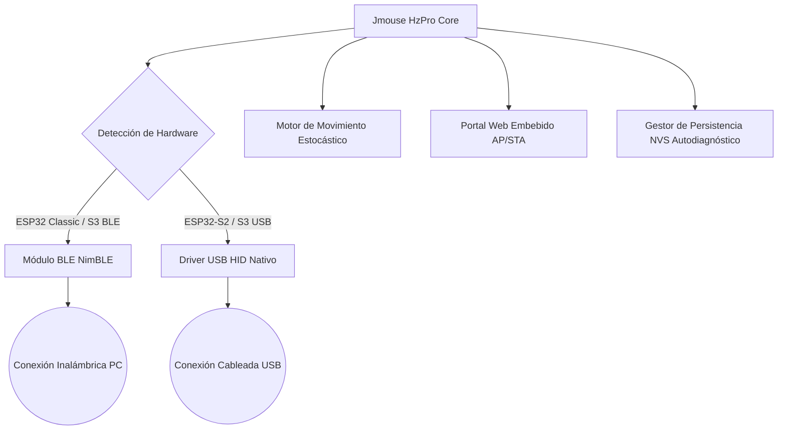
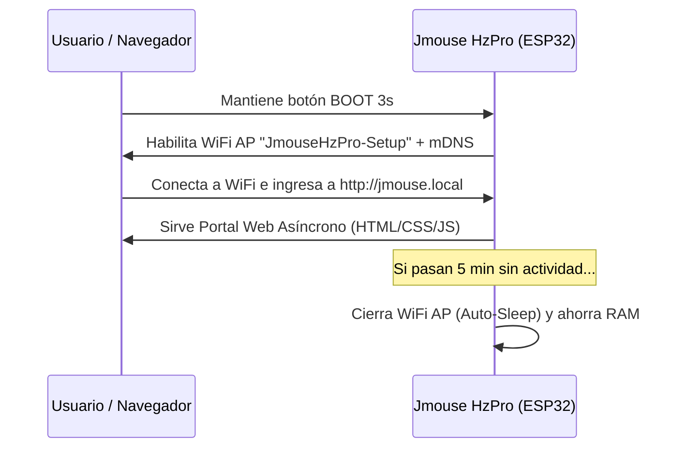
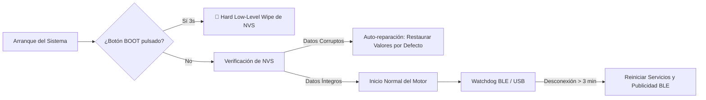

# 🖱️ Jmouse HzPro — Manual Técnico y Guía de Usuario (Professional Documentation)

**Jmouse HzPro** es un firmware avanzado de grado industrial diseñado para convertir microcontroladores de la familia ESP32 en emuladores de movimiento de ratón (Mouse Jigglers) altamente sofisticados. Su arquitectura dual soporta conectividad inalámbrica por **Bluetooth Low Energy (BLE)** y cableada por **USB HID Nativo**, integrando algoritmos de emulación humanizada para evitar la detección por sistemas de monitoreo de inactividad.

---

## 📑 Índice
1. [Arquitectura y Hardware Soportado](#1-arquitectura-y-hardware-soportado)
2. [Instalación y Despliegue](#2-instalación-y-despliegue)
3. [Control Físico e Interfaz Hardware (Botón y LED)](#3-control-físico-e-interfaz-hardware-botón-y-led)
4. [Portal Web y Conectividad (WiFi / mDNS)](#4-portal-web-y-conectividad-wifi--mdns)
5. [Motor de Movimiento y Algoritmos Anti-Detección](#5-motor-de-movimiento-y-algoritmos-anti-detección)
6. [Tolerancia a Fallos y Mecanismos de Seguridad](#6-tolerancia-a-fallos-y-mecanismos-de-seguridad)
7. [Estructura del Repositorio y Desarrollo](#7-estructura-del-repositorio-y-desarrollo)

---

## 1. Arquitectura y Hardware Soportado

El proyecto está diseñado de forma modular utilizando PlatformIO y el framework de Arduino para ESP32. Su capa de abstracción de hardware (HAL) permite que un único código base se adapte automáticamente a las capacidades del SoC objetivo.

### Matriz de Compatibilidad de Hardware

| Modelo | Entorno PlatformIO (`env`) | Modo de Conexión | Características Principales |
| :--- | :--- | :--- | :--- |
| **ESP32 Clásico** | `esp32dev` | Bluetooth (BLE) | Usa `NimBLE` ultra-ligero para optimizar RAM (~260KB libres). |
| **ESP32-S2** | `esp32s2` | USB Nativo (HID) | Emulación por cable directa vía hardware USB OTG. Sin consumo BLE. |
| **ESP32-S3 (BLE)** | `esp32s3_ble` | Bluetooth (BLE) | Conectividad BLE optimizada para el procesador dual-core S3. *(Recomendado)* |
| **ESP32-S3 (USB)** | `esp32s3_usb` | USB Nativo (HID) | Conexión cableada por puerto nativo USB del S3. |



---

## 2. Instalación y Despliegue

### Requisitos Previos del Entorno
1. **Python 3.x**: Asegúrate de que esté agregado a la variable del sistema `PATH`.
2. **PlatformIO Core CLI**: Instalable en terminal ejecutando `pip install -U platformio`.
3. **Controladores USB-Serial (Drivers)**: Es fundamental contar con los controladores correctos para que el sistema operativo asigne un puerto COM virtual a la placa de desarrollo. Según el chip conversor USB-UART de tu placa:
   * **Controlador CP2102 / CP210x**: [Descargar Silicon Labs VCP Drivers](https://www.silabs.com/developers/usb-to-uart-bridge-vcp-drivers)
   * **Controlador CH340 / CH341**: [Descargar WCH CH34x Drivers](http://www.wch-ic.com/downloads/CH341SER_EXE.html)

### Método Rápido (Script Automatizado)
El proyecto incluye un script en Python multiplataforma diseñado para facilitar la compilación y flasheo sin interactuar con comandos complejos de PlatformIO:

```bash
# 1. Abre la terminal en el directorio raíz del proyecto
python flash_tool.py
```
El script te guiará mediante un menú interactivo para seleccionar la placa correcta y el puerto COM disponible.

### Método Manual (PlatformIO CLI)
Para desarrolladores o integración continua (CI), se puede compilar y subir directamente especificando el entorno:
```bash
# Para ESP32 Clásico (Bluetooth):
pio run -e esp32dev -t upload

# Para ESP32-S3 en modo Bluetooth:
pio run -e esp32s3_ble -t upload

# Para ESP32-S2 / S3 en modo USB Nativo:
pio run -e esp32s2 -t upload
```

### Método por Navegador Web (Sin CLI / esptool.spacehuhn.com)
Para facilitar el despliegue en entornos donde no se cuente con herramientas de desarrollo (Python/PIO), se pueden cargar los binarios directamente desde navegadores compatibles con WebSerial (Chrome / Edge):
1. Conectar el ESP32 al PC y acceder a [ESPTool Web Flasher](https://esptool.spacehuhn.com/).
2. Pulsar **"Connect"** y emparejar con el puerto COM de la placa.
3. Cargar los archivos generados en `release_binaries/` con sus respectivos offsets de memoria:
   * **ESP32 Clásico:** `bootloader.bin` (`0x1000`), `partitions.bin` (`0x8000`), `firmware.bin` (`0x10000`).
   * **ESP32-S2 / S3:** `bootloader.bin` (`0x0`), `partitions.bin` (`0x8000`), `firmware.bin` (`0x10000`).
4. Iniciar la grabación con **"Program"**.

---

## 3. Control Físico e Interfaz Hardware (Botón y LED)

El dispositivo se controla mediante un único botón físico (conectado al pin `GPIO0` / Botón BOOT) y proporciona un esquema de retroalimentación visual premium mediante el LED integrado en placa (`GPIO2`).

### Acciones del Botón BOOT (`GPIO0`)

```
[ Click Simple ]      --> Pausar / Reanudar actividad (Alterna entre Jiggle y Pausa).
[ Doble Click ]       --> Cambiar intervalo de jiggle cíclicamente (5s -> 15s -> 30s -> 60s).
[ Triple Click ]      --> Resetear vinculaciones activas de BLE + Forzar un jiggle inmediato.
[ Mantener 3 seg. ]   --> Activar / Desactivar el Portal Web WiFi de configuración.
[ Mantener 10 seg. ]  --> Reseteo de Fábrica (Borrado total de NVS y emparejamientos BLE).
[ Mantener al Boot ]  --> 🛟 Reseteo de Emergencia por Hardware (Hard Low-level Wipe).
```

### Esquema de Retroalimentación Visual (LED)

* **Búsqueda / Emparejamiento BLE**: Parpadeo lento (1 segundo ON / 1 segundo OFF).
* **Conectado y Jiggler Activo**: LED encendido fijo. Al realizar cada movimiento de ratón, el LED se apaga durante 10ms como indicador de pulso.
* **Conectado y Pausado**: **Efecto Respiración suave (Breathing LED)** mediante PWM por hardware (`ledc`).
* **Confirmación de Portal Web (3s)**: 3 destellos rápidos confirmando que el WiFi AP ha sido habilitado.
* **Aviso de Reseteo Inminente (10s)**: A partir del segundo 7 de presión continua, el LED inicia un parpadeo estroboscópico de advertencia antes del borrado.

---

## 4. Portal Web y Conectividad (WiFi / mDNS)

Para permitir una configuración al vuelo sin necesidad de re-flashear el dispositivo, **Jmouse HzPro** monta un servidor web asíncrono y responsivo.



### Características del Portal
* **Modo Access Point (AP)**: Crea una red WiFi abierta llamada `JmouseHzPro-Setup` (IP por defecto: `192.168.4.1`).
* **Resolución mDNS**: Accesible fácilmente introduciendo la URL `http://jmouse.local` en cualquier navegador web.
* **Interfaz de Usuario Web**: Desarrollada en HTML5, CSS3 y Vanilla JS moderno con soporte de modo oscuro y diseño adaptable a dispositivos móviles. Permite ajustar en tiempo real:
  * Selección instantánea de los 8 patrones de movimiento.
  * Ajuste de la amplitud de píxeles y el intervalo base de inactividad.
  * Configuración de la aleatoriedad estocástica y pausas de simulación humana.
  * Gestión de las 3 ranuras (slots) de dispositivos emparejados por Bluetooth.
* **🔌 Auto-Sleep (Ahorro Energético y Estabilidad)**: El WiFi consume gran parte de la memoria y energía del chip. Para garantizar la máxima estabilidad del motor de ratón, el portal web cuenta con un temporizador automático que apaga el WiFi tras **5 minutos de inactividad** en la interfaz.

---

## 5. Motor de Movimiento y Algoritmos Anti-Detección

El principal factor diferenciador de Jmouse HzPro frente a soluciones básicas es su motor estocástico de emulación humana, diseñado para evadir algoritmos heurísticos y de inteligencia artificial de monitoreo de actividad (ej. herramientas de supervisión corporativa).

### Los 8 Patrones de Movimiento

1. `Micro Jiggle` (Modo 0): Movimiento imperceptible de 1-2 píxeles hacia adelante y hacia atrás. No interfiere con el trabajo normal del usuario en la pantalla.
2. `Horizontal` (Modo 1): Barrido suave en el eje X.
3. `Vertical` (Modo 2): Barrido suave en el eje Y.
4. `Cross` (Modo 3): Movimiento combinando ambos ejes en forma de cruz.
5. `Smooth Bezier` (Modo 4): Generación matemática de curvas de Bézier cúbicas, imitando los trazos curvos naturales de una mano humana sobre un ratón físico.
6. `Circle` (Modo 5): Trayectoria orbital calculada trigonométricamente.
7. `Natural Drift` (Modo 6): Deriva aleatoria continua con inercia y suavizado.
8. `Random Mix` (Modo 7 - *Por defecto*): Selección estocástica rotativa entre todos los patrones anteriores.

### Algoritmos Anti-Detección Heurística

```
[ Intervalo Base: 30s ] + [ Variación Aleatoria +/-30% ] = Ejecución impredecible entre 21s y 39s
                                        +
[ Simulación de Descanso Humano ] = Cada 5-15 mins, pausa total de 30s a 120s simulando café/lectura
```

1. **Jitter Estocástico (Variación de Tiempo)**: Si el intervalo está configurado a 30 segundos y la variación al 30%, el dispositivo no se moverá en un bucle exacto de reloj. Cada ejecución calculará un nuevo retardo aleatorio entre 21 y 39 segundos.
2. **Pausas Humanizadas Simuladas**: Un humano real no mueve el ratón de forma constante durante 8 horas. El algoritmo introduce pausas largas (entre 30 segundos y 2 minutos) de forma aleatoria cada 5 a 15 minutos, simulando que el usuario está leyendo un documento extenso o tomando un descanso.

---

## 6. Tolerancia a Fallos y Mecanismos de Seguridad

El firmware incluye múltiples salvaguardas para operar ininterrumpidamente 24/7 sin bloqueos por fragmentación de memoria o desconexión.



1. **🛡️ Autodiagnóstico y Auto-Reparación de NVS**: Al iniciar, el gestor de almacenamiento valida el checksum y la cordura de la estructura de configuración guardada en la memoria Flash no volátil (NVS). Si detecta corrupción por un apagón inesperado, re-inicializa la memoria de forma transparente con los valores de fábrica seguros.
2. **🔄 Watchdog Bluetooth**: En conexiones BLE, si el host (computadora) entra en suspensión o se aleja y la desconexión supera los 3 minutos, el ESP32 reinicia de forma limpia la pila BLE y vuelve a emitir publicidad de emparejamiento.
3. **🛟 Reseteo de Emergencia en Arranque (Hard Hardware Wipe)**: Si una configuración errónea causa un bucle de reinicios incontrolable (Bootloop), mantener pulsado el botón BOOT **antes y durante la conexión del cable USB** por 3 segundos forzará un borrado físico de bajo nivel de toda la partición NVS y las claves de seguridad Bluetooth almacenadas.

---

## 7. Estructura del Repositorio y Desarrollo

Para aquellos ingenieros o desarrolladores que deseen contribuir o extender las capacidades del firmware, el repositorio está estructurado bajo los principios de separación de responsabilidades (SoC):

```
MouseESP/
├── .pio/                       # Archivos de compilación generados por PlatformIO
├── src/                        # Código fuente del sistema en C++
│   ├── config.h                # Definiciones de hardware, pines y constantes globales
│   ├── main.cpp                # Bucle principal, inicialización y máquina de estados general
│   ├── ble_manager.h/.cpp      # Control de conectividad Bluetooth (NimBLE) y Multi-Slot
│   ├── usb_mouse.h/.cpp        # Driver de dispositivo USB HID nativo para ESP32-S2/S3
│   ├── movement.h/.cpp         # Algoritmos de movimiento, curvas Bézier y anti-detección
│   ├── button_handler.h/.cpp   # Controlador de interrupciones y gestos del botón BOOT
│   ├── storage.h/.cpp          # Capa de persistencia en NVS y autodiagnóstico
│   ├── web_portal.h/.cpp       # Servidor web asíncrono, WiFi AP/STA, mDNS y Auto-Sleep
│   └── web_pages.h             # Plantillas HTML5, CSS3 y JS embebidas (Minificadas/Raw)
├── flash_tool.py               # Script CLI en Python para flasheo automatizado
├── platformio.ini              # Configuración de entornos de compilación y librerías
└── README.md                   # Resumen general del repositorio
```

### Flujo de Desarrollo y Compilación Personalizada
* **Librerías Externas Principales**: `ESPAsyncWebServer`, `AsyncTCP`, `NimBLE-Arduino` y `ESP32 BLE Mouse`. Todas gestionadas automáticamente por PlatformIO en `platformio.ini`.
* **Partición de Memoria**: Utiliza una tabla de particiones personalizada (`huge_app.csv`) para maximizar el espacio de código (hasta 3MB para la aplicación) necesario al combinar la pila BLE y las librerías web asíncronas.
